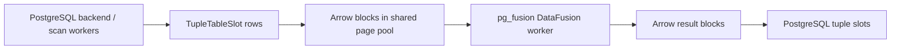

# pg_fusion

`pg_fusion` is an experimental PostgreSQL extension for running selected
analytical `SELECT` queries through Apache DataFusion while PostgreSQL still
owns table access.

DataFusion is a Rust analytical execution engine that runs query operators over
Apache Arrow columnar batches. A useful mental model is "LLVM-like execution
infrastructure for analytical data processing in Rust", not a PostgreSQL storage
engine.

The core boundary is:

> PostgreSQL owns table access; DataFusion owns selected analytical execution
> above PostgreSQL scan streams.

Users connect to PostgreSQL normally. Eligible PostgreSQL backends stream scan
rows into page-backed Arrow batches in shared memory, send the work to a
separate `pg_fusion` background worker that runs DataFusion, and import result
pages back into PostgreSQL tuple slots.

DataFusion is not copied into every backend process.



## Try A Query

After local setup, enable pg_fusion for the session and run an eligible
analytical `SELECT`:

```sql
SET pg_fusion.enable = on;

SELECT count(*)
FROM orders
JOIN lineitem USING (orderkey);
```

See [Quick start](docs/quickstart.md) for a runnable local table setup.

## How It Works

`pg_fusion` installs PostgreSQL hooks and a custom scan path. When a query is
eligible, PostgreSQL still resolves catalogs, owns the snapshot, reads heap
tuples, checks MVCC visibility, handles TOAST, and returns final tuple slots to
the client.

The expensive part is the boundary crossing: PostgreSQL heap tuples are row
oriented, while DataFusion runs on Arrow batches. `pg_fusion` therefore tries to
push filters and narrow projections into PostgreSQL scans before rows are
encoded into Arrow pages. Sending unused rows or columns to the worker can cost
more than the DataFusion execution saves.

For eligible heap scans, PostgreSQL scan work can be split by CTID block ranges.
The shared page pool can import streaming Arrow batches zero-copy, while
retaining operators materialize owned buffers so pages can be reused. See
[Execution model](docs/execution-model.md) and
[Memory and pages](docs/memory-and-pages.md) for the detailed lifecycle.

The DataFusion worker is a shared resource box:

- backend processes keep PostgreSQL session and table-access work;
- one background worker owns DataFusion CPU scheduling, memory, and spill;
- shared memory owns fixed page, control, filter, wakeup, and metrics capacity.

## When It Can Help

`pg_fusion` is intended for analytical reads where the work above PostgreSQL
scans is large enough to justify tuple-to-Arrow conversion and transport.
Typical candidates include:

- join-heavy plans that create large intermediate batches inside the DataFusion
  worker;
- runtime-filter-friendly joins that reduce probe-side scan encoding;
- grouped aggregation after selective PostgreSQL-side filters;
- sort and window-like analytical execution;
- queries where pushed filters and projections greatly reduce scan output.

See [Workloads](docs/workloads.md) for performance fit and
[Query support](docs/query-support.md) for eligibility.

## Status

`pg_fusion` is experimental infrastructure for engineering evaluation,
benchmarks, and workload feedback. Review [Query support](docs/query-support.md)
and [Limitations](docs/limitations.md) before using it beyond controlled
experiments.

## Documentation

The full documentation index is published at
[darthunix.github.io/pg_fusion](https://darthunix.github.io/pg_fusion/) and
lives in [docs/index.md](docs/index.md).

Start with [Quick start](docs/quickstart.md), [Glossary](docs/glossary.md),
[Architecture](docs/architecture.md), [Query support](docs/query-support.md),
and [Configuration](docs/configuration.md).

## Development

Contributor setup starts in [Development](docs/development.md). Internal
maintainer and agent notes live under [`ai/`](ai/); they are not a replacement
for public documentation.
